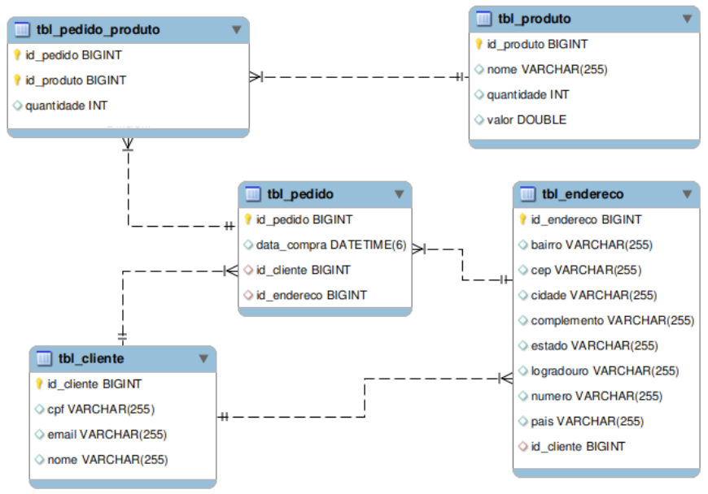

# PersistenceMongo

O objetivo neste projeto foi usar a tecnologia *Spring Data MongoDB* para realizar todas as operações de CRUD nas coleções de um banco de dados NoSQL. 

## Estrutura do projeto

O projeto **PersistenceMongo** foi criado com *Spring Boot* e está organizado da seguinte maneira: 

- O pacote *config* possui a classe de configuração e o *Swagger*;
- O pacote *entity* contém as definições das entidades deste projeto;
- O pacote *repository* contém as interfaces responsáveis pelas operações no banco de dados;
- O pacote *service* contém as interfaces de cada entidade bem como as respectivas implementações. Nas implementações dessas interfaces são onde estão as regras de negócios do projeto.
- O pacote *controller* contém as classes que definem os *endpoints*. Esses *endpoints* são os que provê as interações com os serviços da aplicação.
- O pacote *dto* contém as classes que implementam o padrão de desenvolvimento DTO para os campos essenciais nas interações de alguns serviços.

O *Lombok* foi usado nas classes do pacote *entity* para tornar mais enxuto o código delas. As dependências foram gerenciadas com o *Maven*.

## Diagrama do banco de dados

Neste projeto estão previstas as entidades: Cliente, Endereço, Pedido, Produto e PedidoProduto. De maneira lógica elas se relacionariam da seguinte maneira:



No entanto MongoDB não armazena os registros dessas entidades em tabelas diferentes e relacionadas. Registros de entidades relacionadas são armazenados em um mesmo documento de uma coleção. As coleções do MongoDB neste projeto estão organizadas da seguinte maneira:

**cliente**

```json
{
  "cpf": "string",
  "email": "string",
  "enderecos": [
    {
      "bairro": "string",
      "cep": "string",
      "cidade": "string",
      "complemento": "string",
      "estado": "string",
      "idEndereco": "string",
      "logradouro": "string",
      "numero": "string",
      "pais": "string"
    }
  ],
  "id": "string",
  "nome": "string"
}
```

**endereco**

```json
{
  "bairro": "string",
  "cep": "string",
  "cidade": "string",
  "complemento": "string",
  "estado": "string",
  "idEndereco": "string",
  "logradouro": "string",
  "numero": "string",
  "pais": "string"
}

```

**produto**

```json
{
  "id": "string",
  "nome": "string",
  "quantidade": 0,
  "valor": 0
}
```

**pedido**

```json
{
	"id" : "string",
	"enderecoEntrega" : {
		"id" : "string",
		"logradouro" : "string",
		"numero" : "string",
		"complemento" : "string",
		"bairro" : "string",
		"cep" : "string",
		"cidade" : "string",
		"estado" : "string",
		"pais" : "string"
	},
	"cliente" : {
		"id" : "string",
		"cpf" : "string",
		"nome" : "string",
		"email" : "string",
		"enderecos" : [
			{
				"_id" : "1",
				"logradouro" : "string",
				"numero" : "string",
				"complemento" : "string",
				"bairro" : "string",
				"cep" : "string",
				"cidade" : "string",
				"estado" : "string",
				"pais" : "string"
			}
		]
	},
	"produtos" : [
		{
			"id" : "string",
			"nome" : "string",
			"valor" : 0,
			"quantidade" : 0
		}
	],
	"data" : "string",
}
```

## Instruções para executar
Se preferir, a infraestrutura necessária para a execução do projeto pode ser obtida da imagem para *Docker* que está disponível neste repositório sob o nome de *persistence.yml*. A imagem pode ser usada com os comandos *docker* ou *docker-compose* conforme exemplos a seguir:

```bash
docker stack deploy -compose-file persistence.yml fiap
```

ou

```bash
docker-compose -f persistence.yml up
```

Em seguida, o projeto pode ser executado por meio da classe PersistencemMongoApplication. Ou ainda, na raiz do projeto pelo terminal, executar o comando: 

```bash
./mvnw spring-boot:run
```

As interações com os serviços podem ser feitas por meio do endereço: 

*http://127.0.0.1:8080/swagger-ui.html*

Nesse endereço está a documentação do projeto, os endpoints disponíveis e o que cada um deles espera como entrada.

## Integrantes

- Carlos Henrique Antunes Mendes;
- Felipe Birches Lopes;
- Guilherme Moreira De Brito Moraes;
- Leonardo Villani;
- Luiz Armando Galesso.

## Referências

- https://spring.io/projects/spring-data-mongodb
- https://www.mongodb.com/
- https://spring.io/projects/spring-boot
- https://swagger.io/
- https://projectlombok.org/
- https://maven.apache.org/
- https://www.docker.com/